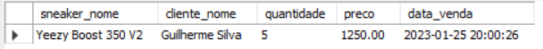

## Contexto do problema

O contexto deste projeto é criar um website para uma loja de sneakers, que suporte o registo, compra e venda de sneakers. Isso inclui a criação de uma base de dados MySQL que armazene informações relevantes, como modelos de sneakers, vendas e clientes. A loja deve permitir que os clientes naveguem pelos modelos de sneakers disponíveis, façam compras e acompanhem seus pedidos. Além disso, os clientes devem ser capazes de se registar e fazer login.

Eis as tabelas que criamos para solucionar o problema em questão:

* Tabela "utilizadores": armazena informações sobre os clientes, incluindo id, nome, email, senha, saldo e se é administrador ou não.
* Tabela "sneaker_modelos": armazena informações sobre os modelos de sneakers, incluindo id, nome do modelo, marca e data de lançamento.
* Tabela "sneakers": armazena informações sobre os sneakers em stock, incluindo id, id do modelo, nome, preço, quantidade em stock, tamanhos disponíveis e imagem.
* Tabela "vendas": armazena informações sobre as vendas, incluindo id, id do sneaker, id do cliente, quantidade, preço e data da venda.

## Diagrama da base de dados


## Definição e descrição das tabelas

#### Tabela Utilizadores
|Campo|Breve Descrição|Tipo de Dados|Tamanho|
|----|----|----|----|
|id|Identificador único|INT|N/A|
|nome|Nome do utilizador|VARCHAR|255|
|email|Email do utilizador|VARCHAR|255|
|password|Password do utilizador|VARCHAR|255|
|saldo|Saldo do utilizador|DECIMAL|10,2|
|is_admin|Indica se o utilizador é administrador|BOOLEAN|N/A|

A tabela "utilizadores" é utilizada para armazenar informações sobre os clientes que acessam o website. Ela contém campos como id, nome, email, senha, saldo e se é administrador ou não. Essas informações são utilizadas para permitir que os clientes façam login no website, gerenciem suas contas e verifiquem seus saldos antes de efetuar uma compra.

#### Tabela modelos dos sneakers
|Campo|Breve Descrição|Tipo de Dados|Tamanho|
|----|----|----|----|
|id|Identificador único|INT|N/A|
|model|Nome do modelo de sneaker|VARCHAR|255|
|marca|Marca do modelo de sneaker|VARCHAR|255|
|data_lancamento|Data de lançamento do modelo de sneaker|DATE|N/A|

A tabela "sneaker_modelos" é utilizada para armazenar informações sobre os diferentes modelos de sneakers disponíveis no website. Ela contém campos como id, modelo, marca e data de lançamento. Essas informações são utilizadas para exibir informações sobre os modelos de sneakers aos clientes e para associar cada sneaker individual com um modelo específico.

#### Tabela Sneakers
|Campo|Breve Descrição|Tipo de Dados|Tamanho|
|----|----|----|----|
|id|Identificador único|INT|N/A|
|model_id|Identificador do modelo de sneaker|INT|N/A|
|nome|Nome da sneaker|VARCHAR|255|
|preco|Preço da sneaker|DECIMAL|10,2|
|stock|Quantidade em stock|INT|N/A|
|tamanhos|Tamanhos disponíveis|VARCHAR|255|
|img|Caminho para a imagem da sneaker|VARCHAR|255|

A tabela "sneakers" é utilizada para armazenar informações sobre os sneakers em stock. Ela contém campos como id, id do modelo, nome, preço, quantidade em stock, tamanhos disponíveis e imagem. Essas informações são utilizadas para exibir informações sobre os sneakers disponíveis para compra e para atualizar o stock quando uma compra é efetuada.

#### Tabela de registo de compras
|Campo|Breve Descrição|Tipo de Dados|Tamanho|
|----|----|----|----|
|id|Identificador único|INT|N/A|
|sneaker_id|Identificador da sneaker vendida|INT|N/A|
|utilizador_id|Identificador do utilizador que comprou|INT|N/A|
|quantidade|Quantidade de sneakers compradas|INT|N/A|
|preco|Preço da venda|DECIMAL|10,2|
|data_venda|Data da venda|TIMESTAMP|N/A|

A tabela "vendas" é utilizada para armazenar informações sobre as vendas realizadas. Ela contém campos como id, id do sneaker, id do cliente, quantidade, preço total e data da venda. Essas informações são utilizadas para rastrear as vendas realizadas e para atualizar o stock e o saldo do cliente quando uma compra é efetuada.

## DDL

### Criação da database

```sql
CREATE DATABASE LojaTenis;

USE LojaTenis;
```

### Criação das tabelas
```sql
CREATE TABLE utilizadores (
    id INT NOT NULL AUTO_INCREMENT,
    nome VARCHAR(255) NOT NULL,
    email VARCHAR(255) NOT NULL,
    password VARCHAR(255) NOT NULL,
    saldo DECIMAL(10,2) NOT NULL DEFAULT 0,
    is_admin BOOLEAN NOT NULL DEFAULT 0,
    PRIMARY KEY (id)
);

CREATE TABLE sneaker_modelos (
    id INT NOT NULL AUTO_INCREMENT,
    model VARCHAR(255) NOT NULL,
    marca VARCHAR(255) NOT NULL,
    data_lancamento DATE NOT NULL,
    PRIMARY KEY (id)
);

CREATE TABLE sneakers (
    id INT NOT NULL AUTO_INCREMENT,
    model_id INT NOT NULL,
    nome VARCHAR(255) NOT NULL,
    preco DECIMAL(10,2) NOT NULL,
    stock INT NOT NULL DEFAULT 0,
    tamanhos VARCHAR(255) NOT NULL,
    img VARCHAR(255) NOT NULL,
    PRIMARY KEY (id),
    FOREIGN KEY (model_id) REFERENCES sneaker_modelos(id)
);

CREATE TABLE vendas (
    id INT NOT NULL AUTO_INCREMENT,
    sneaker_id INT NOT NULL,
    utilizador_id INT NOT NULL,
    quantidade INT NOT NULL,
    preco DECIMAL(10,2) NOT NULL,
    data_venda TIMESTAMP NOT NULL DEFAULT CURRENT_TIMESTAMP,
    PRIMARY KEY (id),
    FOREIGN KEY (sneaker_id) REFERENCES sneakers(id),
    FOREIGN KEY (utilizador_id) REFERENCES utilizadores(id)
);
```

### Stored Procedures
```sql
DELIMITER //
CREATE PROCEDURE atualizar_stock_sneaker(IN sneaker_id INT, IN quantity INT)
BEGIN
    UPDATE sneakers
    SET stock = stock - quantity
    WHERE id = sneaker_id;
END
//
CREATE PROCEDURE inserirCompra (IN sneaker_id INT, IN utilizador_id INT, IN quantidade INT)
BEGIN
    DECLARE tmp_preco DECIMAL(10,2);
    DECLARE tmp_stock INT;
    SELECT preco, stock INTO tmp_preco, tmp_stock FROM sneakers WHERE id = sneaker_id;

    IF quantidade <= tmp_stock THEN
        SET tmp_preco = tmp_preco * quantidade;
        START TRANSACTION;
        INSERT INTO vendas (sneaker_id, utilizador_id, quantidade, preco)
        VALUES (sneaker_id, utilizador_id, quantidade, tmp_preco);
        CALL atualizar_stock_sneaker(sneaker_id, quantidade);
        COMMIT;
    ELSE
        SELECT 'Stock insuficiente';
    END IF;
END
//
CREATE PROCEDURE listarUltimasVendas(IN qtd INT)
BEGIN
    SELECT sneaker_id, utilizador_id, quantidade, preco, data_venda 
    FROM vendas
    ORDER BY data_venda DESC
    LIMIT qtd;
END
//
```

### Triggers
```sql
CREATE TRIGGER verificarSaldoPreVenda
BEFORE INSERT ON vendas
FOR EACH ROW
BEGIN
    DECLARE tmp_saldo DECIMAL(10,2);
    SELECT saldo INTO tmp_saldo FROM utilizadores WHERE id = NEW.utilizador_id;
    IF tmp_saldo < (SELECT preco FROM sneakers WHERE id = NEW.sneaker_id) * NEW.quantidade THEN
        SIGNAL SQLSTATE '45000'
        SET MESSAGE_TEXT = 'Fundos insuficientes para efetuar compra';
    END IF;
END
//
CREATE TRIGGER atualizarSaldoPosVenda
AFTER INSERT ON vendas
FOR EACH ROW
BEGIN
    DECLARE preco_total DECIMAL(10,2);
    SET preco_total = (SELECT preco FROM sneakers WHERE id = NEW.sneaker_id) * NEW.quantidade;
    UPDATE utilizadores SET saldo = saldo - preco_total WHERE id = NEW.utilizador_id;
END
```

### Views
```sql
CREATE VIEW sneaker_infos AS
    SELECT 
        sneaker_modelos.model,
        sneaker_modelos.marca,
        sneaker_modelos.data_lancamento,
        sneakers.nome,
        sneakers.preco,
        sneakers.tamanhos,
        sneakers.img
    FROM
        sneaker_modelos
    JOIN
        sneakers ON sneaker_modelos.id = sneakers.model_id;
//
CREATE VIEW info_vendas_formatado AS
    SELECT 
        sneakers.nome AS sneaker_nome,
        utilizadores.nome AS cliente_nome,
        vendas.quantidade,
        vendas.preco,
        vendas.data_venda
    FROM
        vendas
    JOIN
        utilizadores ON vendas.utilizador_id = utilizadores.id
    JOIN
        sneakers ON vendas.sneaker_id = sneakers.id;
//
```

## Carregamento de dados

### Inserção de utilizadores
```sql
INSERT INTO utilizadores (nome, email, password, saldo) 
VALUES ('Francisco Nascimento', 'sanfran1998@gmail.com', 'Sanfran1998 :)', 100.00);

INSERT INTO utilizadores (nome, email, password, saldo) 
VALUES ('Beatriz', 'bea@email.com', 'dbManager', 50.00);

INSERT INTO utilizadores (nome, email, password, saldo) 
VALUES ('Pedro Teixeira', 'RockAndStone@dwarfmail.com', 'oldmanshower123', 0);

INSERT INTO utilizadores (nome, email, password, saldo, is_admin) 
VALUES ('Guilherme Silva', 'gui@email.com', 'nickGur', 1000000, 1);

INSERT INTO utilizadores (nome, email, password, saldo, is_admin) 
VALUES ('Pedro Martins', 'pedro.martins@email.com', 'password112', 150.00, 1);
```

### Inserção de modelos de sneakers
```sql
INSERT INTO sneaker_modelos (model, marca, data_lancamento) 
VALUES ('Air Jordan 1', 'Nike', '2022-01-01');

INSERT INTO sneaker_modelos (model, marca, data_lancamento) 
VALUES ('Yeezy Boost 350', 'Adidas', '2022-02-01');

INSERT INTO sneaker_modelos (model, marca, data_lancamento) 
VALUES ('Air Max 90', 'Nike', '2022-03-01');

INSERT INTO sneaker_modelos (model, marca, data_lancamento) 
VALUES ('Ultra Boost', 'Adidas', '2022-04-01');

INSERT INTO sneaker_modelos (model, marca, data_lancamento) 
VALUES ('Converse Chuck Taylor', 'Converse', '2022-05-01');

INSERT INTO sneaker_modelos (model, marca, data_lancamento) 
VALUES ('Superstar', 'Adidas', '2022-06-01');

INSERT INTO sneaker_modelos (model, marca, data_lancamento) 
VALUES ('Air Force 1', 'Nike', '2022-07-01');
```

### Inserção de sneakers
```sql
INSERT INTO sneakers (model_id, nome, preco, stock, tamanhos, img) 
VALUES (1, 'Air Jordan 1 Retro', 110.00, 10, '7,8,9,10,11', 'jordan1.jpg');

INSERT INTO sneakers (model_id, nome, preco, stock, tamanhos, img) 
VALUES (2, 'Yeezy Boost 350 V2', 250.00, 5, '8,9,10', 'yeezy350.jpg');

INSERT INTO sneakers (model_id, nome, preco, stock, tamanhos, img) 
VALUES (3, 'Air Max 90 Essential', 90.00, 15, '7,8,9,10,11', 'airmax90.jpg');

INSERT INTO sneakers (model_id, nome, preco, stock, tamanhos, img) 
VALUES (4, 'Ultra Boost Uncaged', 180.00, 8, '8,9,10,11', 'ultraboost.jpg');

INSERT INTO sneakers (model_id, nome, preco, stock, tamanhos, img) 
VALUES (5, 'Converse Chuck Taylor All Star', 60.00, 20, '7,8,9,10,11', 'chucktaylor.jpg');

INSERT INTO sneakers (model_id, nome, preco, stock, tamanhos, img) 
VALUES (6, 'Adidas Superstar', 80.00, 12, '8,9,10,11', 'superstar.jpg');
```

### Demonstração dos sprocs, triggers e views

#### Simulação de situação

O Guilherme sendo o mais rico tem 1.000.000€ na conta.
Por isso vai comprar 100 Yeezy Boost 350 V2s.

```sql
-- demonstração da sproc de inserirCompra(id_sneaker, id_user, quantidade)
CALL inserirCompra(2,4,100);
```

O resultado da sproc é:


Sendo que só existem 5 desses sneakers em stock, decide comprar o resto.

```sql
CALL inserirCompra(2,4,5);
```

O resultado da sproc é refletido no stock do sneaker:

```sql
SELECT * FROM sneakers WHERE id = 2;
```


E devido ao trigger `atualizarSaldoPosVenda`:
```sql
SELECT saldo FROM utilizadores WHERE id = 4;
```


O Francisco a seguir vai para comprar esses sneakers mas...

```sql
CALL inserirCompra(2,1,1);
```

Não existe stock suficiente:


Ele desiste.

Então o Pedro decide comprar uns adidas superstar:

```sql
CALL inserirCompra(6,3,1);
```

Mas devido ao trigger `verificarSaldoPreVenda`, é notificado que não tem saldo suficiente..


#### Views

Usando a view `sneaker_infos` conseguimos ver os sneakers introduzidos e os dados do seu modelo:
```sql
SELECT * FROM sneaker_infos;
```

Usando a view `info_vendas_formatado` conseguimos ver todas as vendas efetuadas, mostrando o utilizador e o sneaker que foi comprado, junto com a quantidade e o preço total:
```sql
SELECT * FROM info_vendas_formatado;
```

Inclusive se quisermos ver as vendas efetuadas por um utilizador em especifico podemos:
```sql
SELECT * FROM info_vendas_formatado WHERE id_utilizador = 4;
```
E com isto vemos as compras que o Guilherme efetuou:



### Conclusão

A base de dados fornecida é projetada para gerenciar uma loja virtual de sneakers, incluindo tabelas para armazenar informações sobre clientes, modelos de sneakers, sneakers em stock e vendas. Essas tabelas são conectadas entre si através de chaves estrangeiras para permitir a relação de dados entre elas, permitindo assim uma gestão eficiente da loja. As stored procedures, triggers e views foram criadas para garantir a consistência dos dados e para automatizar tarefas comuns.